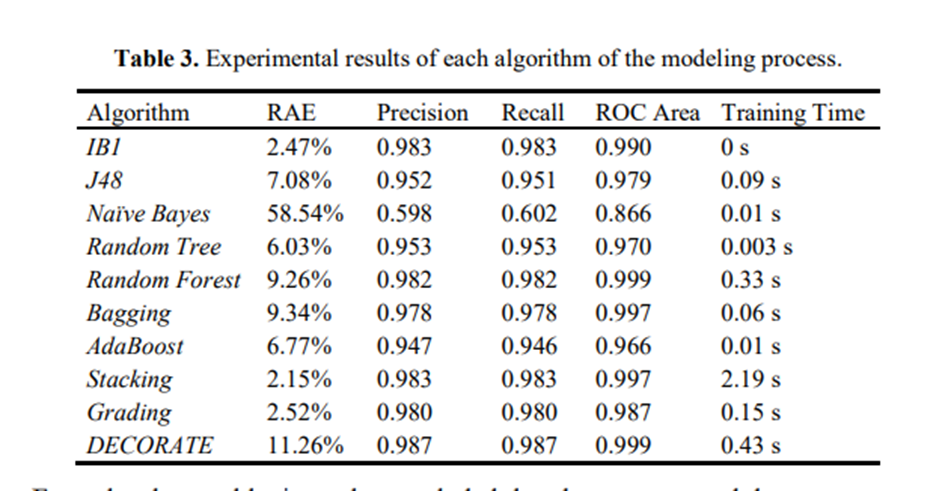

# References

## Research articles

### Cocoa yield forecasting

#### **\[1] Predictive model for cocoa yield in Santander using Supervised Machine Learning.**

**Gamboa, A.A., Cáceres, P.A., Lamos, H., Zárate, D.A. and Puentes, D.E., 2019, April. Predictive model for cocoa yield in Santander using Supervised Machine Learning. In **_**2019 XXII Symposium on Image, Signal Processing and Artificial Vision (STSIVA)**_** (pp. 1-5). IEEE.**

Access: [https://sci-hub.se/10.1109/stsiva.2019.8730258](https://sci-hub.se/10.1109/stsiva.2019.8730258)

Predicitve analysis based on Transpiration, water use efficiency, stem diameter, organic matter (OM) level, sodium (Na) level, phosphorus (P) level, magnesium (Mg) level, Radiation, Temperature, Humidity and cumulative precipitation.

Used:

* Generalised Linear Model (GLM)
* Support Vector Machines (SVM)

A hold out technique was used to validate the model. In addition, a validation set was used so that the validation of the algorithm was performed on a dataset different from the one used to estimate its parameters. The metrics used were RMSE (root mean square error), confidence interval and p-value. The respective RMSEs were 1758.7421 for the SVM and 1700.0615 for the GLM.

#### **\[2] A tool for classification of cacao production in colombia based on multiple classifier systems.**

**Plazas, J.E., López, I.D. and Corrales, J.C., 2017. A tool for classification of cacao production in colombia based on multiple classifier systems. In **_**Computational Science and Its Applications–ICCSA 2017: 17th International Conference, Trieste, Italy, July 3-6, 2017, Proceedings, Part II 17**_** (pp. 60-69). Springer International Publishing.**

Access: [https://sci-hub.se/10.1007/978-3-319-62395-5\_5](https://sci-hub.se/10.1007/978-3-319-62395-5\_5)

Source of cocoa data is National Federation of Cacao Growers of Columbia (FEDECACAO). Annual cocoa bean production by department (where records are from 2002 to 2014); area, production and annual cocoa yield (national records from 2005 to 2011) and monthly cocoa bean production (national records from 2006 to 2010). Information on annual cocoa bean production by department was used to determine the period and geographical area over which data were obtained.

Sources of climatological data are:

* Tutiempo.net, which contains data collected at the climate stations of Colombia's main airports. This source contains data from two Santander regions, Barrancabermeja (1964-2016) and Bucaramanga (1975-2016);
* NOAA's NCEP/NCAR Reanalysis has collected satellite data on climatic values since 1948.

Experimental tests of three supervised learning algorithms were carried out to determine which dataset was most suitable: daily, weekly, biweekly: M5P, M5Rules and kNN. Cross-validation was carried out, where the criterion for comparison was the correlation coefficient. The set with an interval of two weeks proved to be the best. The final dataset contains approximately 1,800 instances and four attributes: month, mean daily temperature, mean daily relative humidity and mean daily cumulative precipitation at Santander. The numerical target class 'cocoa production' was discretised. Five value ranges were defined as 'very low production' (0-876 tonnes), 'low production' (876-1274 tonnes), 'medium production' (1274-1673 tonnes). (1274-1673 tonnes), 'high production' (1673-2071 tonnes) and 'very high production' (>2071 tonnes).

Modele zostały wykonane i uruchomione w aplikacji WEKA. Modele:

·        IBk. Implementuje k-NN. Testowane od 1 do 100. Ostatecznie została wybrana wartość k=1.

·        J48. Implementacja drzewa decyzyjnego C4.5

·        Naiwna sieć Bayesa (Naive Bayes)

·        Drzewo losowe (Random Tree)

·        Las losowy (Random Forest)

·        Bagging. Bootstrap Aggregating

·        AdaBoost. Adaptive Boosting

·        Stacking

·        Grading

·        DECORATE. Diverse Ensemble Creation by Oppositional Relabeling of Artificial Training Examples. Tworzenie zróżnicowanych zespołów poprzez przeciwstawne przeklasyfikowywanie sztucznych przykładów szkoleniowych

Wygenerowanie modele zostały przetestowane przy użyciu metody 10-krotnej walidacji krzyżowej, która jest jednym z najbardziej wiarygodnych mechanizmów oceny dokładności modelu.

Jako metryki wykorzystano:

·        RAE (Relative Absolute Error)

·        Precision – precyzja

·        Recall – Czułość

·        Receiver Operating Characteristics Area (ROC Area)

·        Czas treningu

<figure><figcaption></figcaption></figure>

<figure><figcaption></figcaption></figure>

#### Forecasting Cocoa Yields for 2050

**\[3] Kozicka, M., Tacconi, F., Horna, D. and Gotor, E., 2018. Forecasting cocoa yields for 2050.**

Access: [https://cgspace.cgiar.org/bitstream/handle/10568/93236/Kozicka\_ForecastingCocoa\_2018.pdf?sequence=6\&isAllowed=y](https://cgspace.cgiar.org/bitstream/handle/10568/93236/Kozicka\_ForecastingCocoa\_2018.pdf?sequence=6\&isAllowed=y)

A good source of weather data can be https://www.worldclim.org/.

Model used: ARIMA Metrics:

* MAPE - Mean Absolute Percentage Error
* MAE - Mean Absolute Error
* CAGR - Compound Annual Growth Rate

.png>)

.png>)

The International Model for Policy Analysis of Agricultural Commodities and Trade (IMPACT) is an example of a structural simulation model to analyse the cocoa market globally in the future. The model was developed at the International Food Policy Research Institute (IFPRI) to consider the long-term challenges facing policymakers in reducing hunger and sustainable poverty. IMPACT is the main quantitative tool used by Global Futures & Strategic Foresight (GFSF), in which Bioversity International participates as a partner.

The comparison is between the ARIMA model and the IMPACT model described earlier. Example for Côte d'Ivoire:

<figure><figcaption></figcaption></figure>

<figure><figcaption></figcaption></figure>

#### Comparison Between Machine Learning Models for Yield Forecast in Cocoa Crops in Santander, Colombia

**\[4] Lamos-Díaz, H., Puentes-Garzón, D.E. and Zarate-Caicedo, D.A., 2020. Comparison Between Machine Learning Models for Yield Forecast in Cocoa Crops in Santander, Colombia. **_**Revista Facultad de Ingeniería**_**, **_**29**_**(54).**

Access: [http://www.scielo.org.co/pdf/rfing/v29n54/0121-1129-rfing-29-54-e10853.pdf](http://www.scielo.org.co/pdf/rfing/v29n54/0121-1129-rfing-29-54-e10853.pdf)

Models used:

* Machine learning
  * Support Vector Machines (SVM)
  * Ensemble learning models (Random forests, Gradient boosting)
* Regression models
  * Least Absolute Shrinkage
  * Selection Operator (LASSO)&#x20;

The predictors considered were climate conditions, cacao variety, fertilisation level and sun exposure in an experimental crop located in Rionegro, Santander. The results showed that Gradient Boosting is the best alternative prediction with a coefficient of determination (R2) = 68%, Mean Absolute Error (MAE) = 13.32, and Root Mean Square Error (RMSE) = 20.41. Yield variability is mainly explained by radiation in the month before harvest, total rainfall in the month of harvest and temperature in the month before harvest. before harvest. Similarly, yields are assessed by the type of sun exposure. Radiation in the month before harvest was found to be the most influential factor.

### Crop yield forecasting using weather data

#### \[1] Crop Yield Prediction Using Machine Learning Models: Case of Irish Potato and Maize

Kuradusenge, M., Hitimana, E., Hanyurwimfura, D., Rukundo, P., Mtonga, K., Mukasine, A., Uwitonze, C., Ngabonziza, J. and Uwamahoro, A., 2023. Crop Yield Prediction Using Machine Learning Models: Case of Irish Potato and Maize. _Agriculture_, _13_(1), p.225.

Access: [https://www.mdpi.com/2077-0472/13/1/225](https://www.mdpi.com/2077-0472/13/1/225)

## Books

### _Practical time series analysis: Prediction with statistics and machine learning_.

**Nielsen, A., 2019. **_**Practical time series analysis: Prediction with statistics and machine learning**_**. O'Reilly Media.**

Great book explaining the basis of statistical models such as ARIMA family models, VARIMA family models, seasonal-oriented SARIMA, state variable models like Kalman filter, hidden Markow models, BSTS (Bayesian structural time series) as well as machine learning and deep learning models.

## Websites

\[1] [https://neptune.ai/blog/select-model-for-time-series-prediction-task](https://neptune.ai/blog/select-model-for-time-series-prediction-task)

Good source to draw the picture of time series prediction task.

